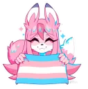

  

<h1 align="center">The Furry Nation Discord Bot</h1>

  
  
  
  
  

  The discord bot for my discord server "Furry Nation". A welcoming community for furries, anime fans, and enthusiasts from around the world. Join us to share art, make friends, and celebrate our furry passions! 🎨🌐

## Contributing

Contributions are welcome! To contribute to the Furry Nation Discord Bot, please follow these steps:

1. Fork the repository.
2. Create a new branch for your feature or bugfix: `git checkout -b feature/new-feature`.
3. Make your changes and commit them: `git commit -m 'Add new feature'`.
4. Push to your branch: `git push origin feature/new-feature`.
5. Submit a pull request to the `main` branch of the repository.

## Support

If you encounter any issues or have questions, please join our [Discord server](https://discord.gg/MAwjqYCyfA) for assistance.

## License

This project is licensed under the [GNU GENERAL PUBLIC License](LICENSE).
